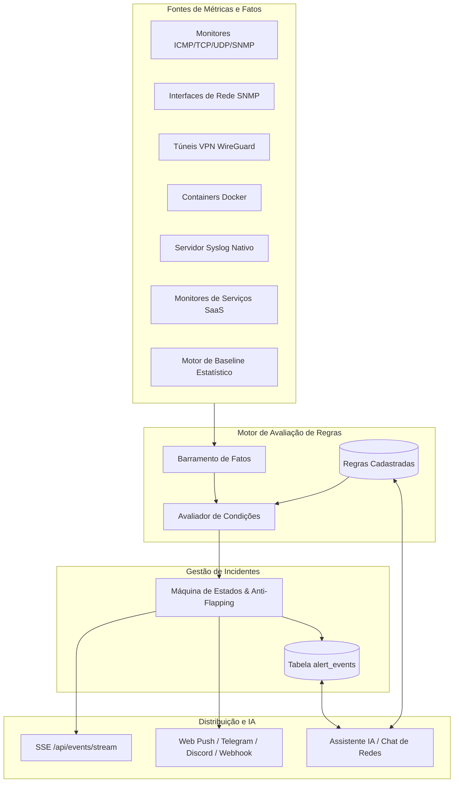
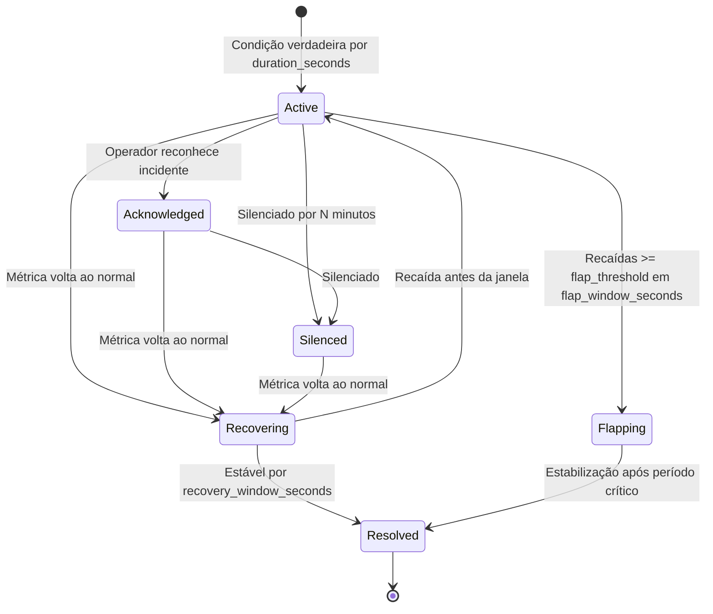

# Sistema de Regras de Alerta e Notificações — NetMonitor

Este documento detalha a arquitetura, o funcionamento operacional, o vocabulário de condições, os mecanismos de estabilização contra ruído e a integração com o Assistente IA para criação, diagnóstico e gestão do ciclo de vida das regras de alerta no NetMonitor.

---

## 1. Visão Geral e Arquitetura

O NetMonitor possui um motor de alertas reativo e desacoplado que opera continuamente sobre as métricas coletadas por múltiplos subsistemas:

### Características Centrais
1. **Desacoplamento por Fatos**: As sondas e checagens não disparam alertas diretamente. Elas publicam *fatos* com nomes padronizados (`latencyMs`, `status`, `cpuUsagePercent`, etc.).
2. **Escopo Flexível**: Uma regra pode valer para toda a infraestrutura (**global**), para um **site**, para um **dispositivo** específico ou para um único **monitor**.
3. **Imutabilidade e Auditoria**: Toda criação, alteração ou exclusão de regra gera entrada na tabela de auditoria (`audit_logs`) e evento em tempo real via SSE.
4. **Proteção de Histórico**: Ao excluir uma regra, os eventos vinculados a ela (`alert_events`) são removidos em cascata. Para apenas cessar notificações mantendo o histórico para relatórios e SLA, desativa-se a regra (`enabled: false`).

---

## 2. Como um Alerta Nasce

1. **Amostragem**: Em cada ciclo de execução (agendador de monitores, trap SNMP, pacote Syslog ou leitura de status), os valores apurados são organizados em um dicionário de fatos.
2. **Casamento de Escopo**: O motor seleciona as regras ativas (`enabled = true`) cujo escopo inclui o alvo:
   - Se a regra define `monitor_id`, aplica-se apenas a esse monitor.
   - Se define `device_id`, aplica-se a todos os monitores e interfaces desse dispositivo.
   - Se define `site_id`, aplica-se aos dispositivos daquele site.
   - Se todos os escopos forem nulos, a regra é **global**.
3. **Avaliação da Condição**: A condição `{field, operator, value}` é comparada contra os fatos atuais.
4. **Janela de Confirmação (`duration_seconds`)**: Para evitar alarmes provocados por picos isolados (jitter transitório, perda momentânea de pacote único), o alerta só transiciona para ativo se a condição se mantiver verdadeira de forma contínua durante `duration_seconds`.
5. **Inibição por Dependência (`inhibit_when_parent_down`)**: Se o equipamento pai (uplink ou roteador gateway configurado na topologia) já estiver em estado crítico/down, os alertas secundários de dispositivos a jusante podem ser suprimidos para evitar tempestade de notificações.
6. **Abertura do Alerta**: Cria-se um registro na tabela `alert_events` com status `active`, associado à regra (`alert_rule_id`) e à chave de escopo (`scope_key`, ex: `monitor:12`, `interface:34`, `vpn_peer:5`). Existe no máximo um alerta aberto por combinação de regra e alvo.

---

## 3. Ciclo de Vida do Alerta

- **`active`**: Condição de falha confirmada e incidente aberto. Notificações disparadas conforme canais configurados.
- **`acknowledged`**: Um operador indicou estar ciente e atuando no problema.
- **`silenced`**: Notificações suspensas temporariamente para o alerta específico por um período determinado.
- **`recovering`**: A métrica retornou à faixa segura, mas o motor aguarda a janela de recuperação (`recovery_window_seconds`) para certificar-se de que a estabilidade é real.
- **`flapping`**: Ocorrência de oscilações repetidas (recaídas frequentes). O sistema consolida o estado para evitar disparos contínuos de notificações repetitivas.
- **`resolved`**: Incidente finalizado com sucesso após confirmação de estabilidade.

---

## 4. Vocabulário de Fatos (`condition.field`) e Operadores

O NetMonitor valida estritamente o campo contra o vocabulário oficial (`ALERT_FIELDS`) para impedir regras órfãs.

### 4.1. Operadores Suportados
| Operador | Significado | Tipos Aplicáveis | Exemplo |
| :--- | :--- | :--- | :--- |
| `eq` | Igual | Números, Strings, Booleans | `status eq "down"` |
| `neq` | Diferente | Números, Strings | `statusCode neq 200` |
| `gt` | Maior que | Números, Durações | `latencyMs gt 150` |
| `gte` | Maior ou igual a | Números, Porcentagens | `cpuUsagePercent gte 90` |
| `lt` | Menor que | Números | `ifSpeed lt 1000000000` |
| `lte` | Menor ou igual a | Números | `batteryLevel lte 20` |
| `contains` | Contém trecho | Strings | `logMessage contains "BGP_DOWN"` |

### 4.2. Campos por Categoria

#### Conectividade e Monitores
- `status`: Estado do monitor (`"up"`, `"down"`, `"warning"`, `"unknown"`).
- `latencyMs`: Tempo de resposta RTT em milissegundos.
- `packetLoss`: Percentual de pacotes perdidos (0 a 100%).
- `statusCode`: Código de resposta HTTP (ex: 200, 404, 500).
- `durationMs`: Duração total da transação/requisição.
- `connectTimeMs`: Tempo para estabelecimento de handshake TCP.
- `resolutionTimeMs`: Tempo para resolução DNS.
- `reachabilityCause`: Causa textual de inacessibilidade (ex: timeout, unreach).

#### Saúde do Equipamento (SNMP / Host)
- `cpuUsagePercent`: Utilização de CPU (0 a 100%).
- `memoryUsedPercent`: Percentual de memória RAM utilizada.
- `storageUsedPercent`: Percentual de ocupação em disco/storage.
- `loadAverage1m`: Carga média do sistema (1 minuto).
- `snmpUptime`: Tempo de atividade reportado por SNMP (centésimos de segundo).

#### Interfaces de Rede SNMP
- `interfaceName`: Nome da interface (ex: `ether1`, `sfp-sfpplus1`).
- `interfaceOperStatus`: Status operacional da porta (1 = Up, 2 = Down).
- `interfaceStatusTransition`: Transição rápida (`"up_to_down"`, `"down_to_up"`).
- `interfaceSpeedBps`: Velocidade negociada da interface em bits por segundo.
- `interfaceSpeedTransition`: Mudança de negociação (`"downgrade"`, `"upgrade"`).
- `interfaceSpeedDropPercent`: Percentual de queda abrupta de velocidade negociada.
- `inBps` / `outBps`: Tráfego de entrada e saída em bits por segundo.

#### Túneis WireGuard VPN
- `vpnPeerName`: Nome do peer ou unidade remota.
- `vpnPeerStatus`: Status do túnel (`"connected"`, `"unstable"`, `"disconnected"`, `"awaiting"`).
- `vpnStatusTransition`: Mudança de estado (`"connected_to_disconnected"`, `"reconnected"`).
- `vpnSecondsSinceActivity`: Segundos decorridos desde o último handshake/tráfego WireGuard.

#### Syslog e Padrões de Log
- `logPatternKey`: Identificador único do padrão de mensagem detectado.
- `logMatchCount`: Quantidade de ocorrências do padrão dentro da janela.
- `logWindowSeconds`: Janela de tempo de agregação dos logs.
- `logSeverity`: Nível de severidade RFC 5424 (0 = Emergência a 7 = Debug).
- `logMessage`: Conteúdo textual da linha de log.

#### Anomalias Estatísticas (Baselines & Z-Scores)
O motor estatístico calcula o comportamento normal histórico do alvo para a mesma hora e dia:
- `latencyZScore`: Desvio-padrão da latência atual em relação à média histórica (Z ≥ 3 indica anomalia severa).
- `latencyDeviationPercent`: Percentual de desvio relativo sobre a linha de base de latência.
- `latencyUpperBandMs`: Limite superior esperado para a latência atual.
- `packetLossZScore`: Z-Score de perda de pacotes.
- `uptimeZScore`: Desvio da taxa de disponibilidade.
- `syslogVolumeZScore`: Anomalia em tempestades de mensagens de log.
- `trafficInZScore` / `trafficOutZScore`: Picos incomuns de tráfego.

---

## 5. Parâmetros de Estabilidade e Prevenção de Ruído

| Parâmetro | Função | Valor Recomendado |
| :--- | :--- | :--- |
| `duration_seconds` | Exige que a condição persista continuamente antes de abrir alerta | 60 a 300 s (evita picos passageiros) |
| `recovery_window_seconds` | Exige que a métrica se mantenha estável antes de resolver o alerta | 30 a 120 s (evita falso alívio) |
| `flap_threshold` | Número de recaídas para declarar o alerta em flapping | 3 a 5 recaídas |
| `flap_window_seconds` | Janela de tempo considerada para contagem de oscilações | 900 s (15 min) |
| `notification_cooldown_seconds` | Intervalo mínimo de silêncio entre notificações do mesmo incidente | 1800 a 3600 s |
| `inhibit_when_parent_down` | Não notifica filhos se o dispositivo pai ou uplink estiver offline | `true` para equipamentos atrás de roteadores |

---

## 6. Gestão pela Interface Web (`/alerts`)

Na rota `/alerts` da aplicação:
- **Aba Pendentes**: Visualização dos incidentes em aberto com badges de severidade, status, tempo decorrido, diagnósticos e botão direto para consulta ao Assistente IA.
- **Aba Regras**: Tabela com todas as regras cadastradas, indicando escopo, critério, severidade, switch de ativação rápida (`enabled`) e ações de edição/exclusão.
- **Catálogo de Regras Pré-configuradas**: Diálogo acessível pelo botão no cabeçalho com receitas de boas práticas prontas para instalação imediata.
- **Formulário de Nova Regra**: Cadastro assistido com autocompletar para campos válidos e escopo customizado.

---

## 7. Gestão e Diagnóstico pelo Assistente IA

O Chat de Redes integrado (disponível pelo painel lateral e botões contextuais nas tabelas) possui ferramentas nativas para operar sobre regras e alertas com segurança.

### 7.1. Ferramentas Disponíveis para a IA
1. `get_alert_rules_guide`: Consulta o guia embutido de regras, fatos e operadores.
2. `list_alert_rules`: Lista regras cadastradas com filtragem por dispositivo, trecho de condição e indicação se a regra é ruidosa (`fired_24h >= 10`).
3. `explain_alert`: **Diagnostica de onde vem o alerta**. Retorna:
   - A regra exata que disparou (condição, severidade, escopo, histórico de disparos).
   - O alvo afetado (equipamento, monitor, interface ou peer VPN).
   - Os fatos e métricas reais que causaram o disparo.
   - Outros alertas concomitantes abertos no mesmo equipamento.
4. `create_alert_rule`: Propõe a criação de uma nova regra. **Sempre exige confirmação do usuário no chat**.
5. `toggle_alert_rule`: Ativa ou desativa uma regra existente mantendo intacto o histórico de alertas. **Exige confirmação**.
6. `delete_alert_rule`: Exclui a regra e o histórico associado. Suporta exclusão passando `rule_id` ou diretamente pelo `alert_id` do incidente em análise. **Sempre exige confirmação explícita no chat**.

### 7.2. Fluxo Recomendado de Diagnóstico com a IA
Quando um alerta dispara ou o operador solicita ajuda:
1. O usuário clica em **IA** no alerta ou pergunta *"De onde vem o alerta #X?"*.
2. A IA invoca `explain_alert(alert_id: X)` e analisa a condição que casou e os fatos medidos.
3. Se a regra apresentar muitos disparos em 24h (`noisy: true`), a IA sugere aumentar `duration_seconds` ou ativar detecção de flapping, orientando a não deletar a regra prematuramente.
4. Se o usuário solicitar parar o alerta ou remover a regra, a IA propõe:
   - **Desativar a regra** (`toggle_alert_rule`) para suspender avisos sem perder histórico de auditoria; OU
   - **Excluir a regra** (`delete_alert_rule`), alertando previamente que todos os alertas vinculados serão removidos do banco de dados.

---

## 8. Receitas Canônicas

### Host Fora do Ar
- **Condição**: `status eq "down"`
- **Duração**: 60 s | **Severidade**: `critical`
- **Escopo**: Monitor específico ou Global

### Degradação Crítica de Latência
- **Condição**: `latencyMs gt 150`
- **Duração**: 120 s | **Severidade**: `warning`
- **Recuperação**: 60 s

### Perda Elevada de Pacotes
- **Condição**: `packetLoss gte 20`
- **Duração**: 120 s | **Severidade**: `warning`

### Sobrecarga de CPU no Equipamento
- **Condição**: `cpuUsagePercent gte 90`
- **Duração**: 300 s | **Severidade**: `warning`

### Esgotamento de Disco / Armazenamento
- **Condição**: `storageUsedPercent gte 90`
- **Duração**: 60 s | **Severidade**: `critical`

### Queda de Porta / Uplink de Rede
- **Condição**: `interfaceStatusTransition eq "up_to_down"`
- **Duração**: 0 s | **Severidade**: `critical`

### Renegociação Indesejada de Link (Downgrade de Porta)
- **Condição**: `interfaceSpeedTransition eq "downgrade"`
- **Duração**: 0 s | **Severidade**: `warning`

### Queda de Túnel WireGuard VPN
- **Condição**: `vpnStatusTransition eq "connected_to_disconnected"`
- **Duração**: 30 s | **Severidade**: `critical`

### Falha em Serviço Web HTTP
- **Condição**: `statusCode gte 500`
- **Duração**: 60 s | **Severidade**: `critical`
