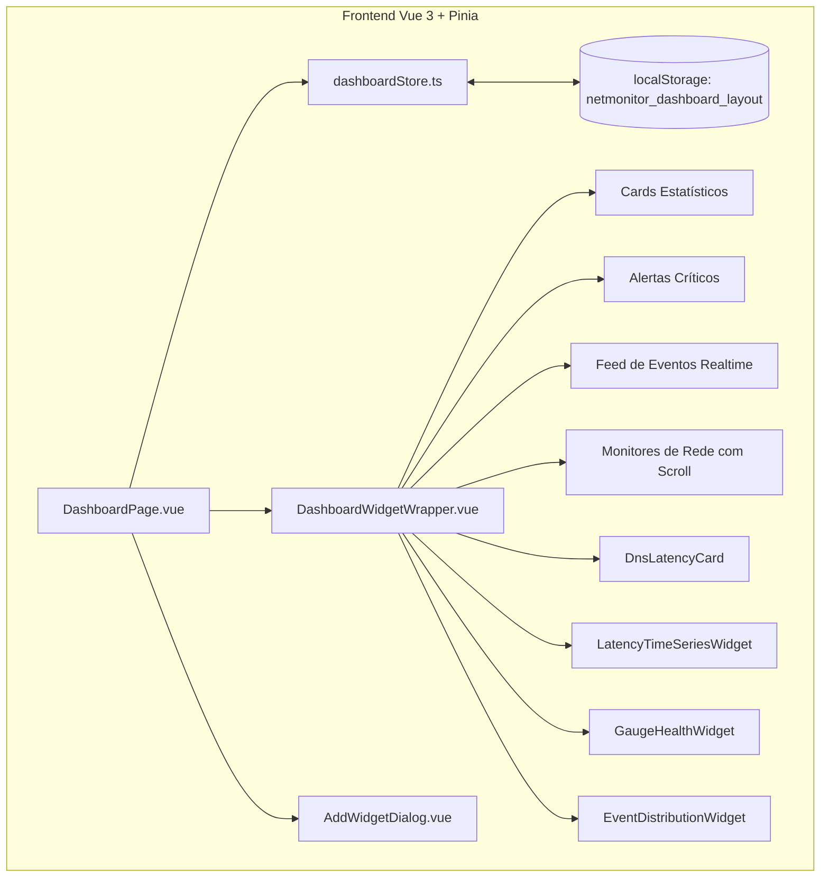

# Roadmap: Dashboard Customizável & Gráficos Estilo Grafana

> **Status:** 🟢 Especificado / Em Implementação  
> **Data:** Agosto de 2026  
> **Escopo:** Transformação do Dashboard principal em uma experiência modular, altamente customizável e interativa (inspirada no Grafana), mantendo estritamente o layout e design system base Vuetify existentes.

---

## 📌 1. Visão Geral & Objetivos

O objetivo principal deste projeto é evoluir o **Dashboard principal** ([`DashboardPage.vue`](../frontend/src/pages/DashboardPage.vue)) para uma central de monitoramento moderna, flexível e rica em telemetria visual, sem comprometer a identidade visual e o padrão já consolidado da aplicação.

### Requisitos Fundamentais
1. **Preservação da Interface Base**: Manter o esquema de cores, tipografia, PageHeader e visual dos cards originais.
2. **Scroll & Altura Limitada no Card "Monitores de Rede"**: Fixar a altura máxima do card de monitores (ex: `420px`) com barra de rolagem suave e customizada, mantendo cabeçalho e botão de ação sempre visíveis.
3. **Customização Dinâmica Estilo Grafana**:
   - **Modo Edição (Edit Mode)** com alternância na barra superior.
   - **Adicionar / Remover Widgets**: Catálogo de cards padrão e novos painéis de métricas.
   - **Reordenar / Mover Widgets**: Arrasto (Drag & Drop) ou controles intuitivos de ordenação.
   - **Opcionalidade de Cards**: O usuário pode ocultar ou exibir qualquer card.
   - **Persistência**: Salvamento do layout personalizado no `localStorage` (com opção de restaurar padrão).
4. **UX Premium & Gráficos Ricos**:
   - Gráficos temporais (Time Series) de latência e perda de pacotes.
   - Anel de distribuição da saúde global (Health Status Donut/Gauge).
   - Histograma de severidade de eventos por hora.
   - Indicadores visuais em tempo real alimentados por SSE.

---

## 🏗️ 2. Arquitetura Técnica & Componentes



### Lista de Componentes Novos / Modificados

| Componente / Arquivo | Responsabilidade | Status |
| :--- | :--- | :---: |
| `frontend/src/stores/dashboard.ts` | Gerencia o estado do layout (visibilidade, ordem, tamanho e configurações dos widgets) com persistência em `localStorage`. | 🟢 A Criar |
| `frontend/src/components/DashboardWidgetWrapper.vue` | Envolucro reusável para cards do dashboard. Fornece cabeçalho de edição, alça de arrasto, botão de remover e ocultar no modo edição. | 🟢 A Criar |
| `frontend/src/components/AddWidgetDialog.vue` | Diálogo modal com catálogo visual para reativar/adicionar widgets ocultos ou novos gráficos ao dashboard. | 🟢 A Criar |
| `frontend/src/components/widgets/LatencyTimeSeriesWidget.vue` | Gráfico temporal estilo Grafana com seleção de intervalo (5m, 15m, 1h, 24h) exibindo latência média e perda de pacotes. | 🟢 A Criar |
| `frontend/src/components/widgets/GaugeHealthWidget.vue` | Donut/Gauge interativo com percentual de disponibilidade e contadores por estado (Up, Down, Warning, Unknown). | 🟢 A Criar |
| `frontend/src/components/widgets/EventDistributionWidget.vue` | Gráfico de barras por hora divididas por severidade de eventos (Crítico, Alerta, Info). | 🟢 A Criar |
| `frontend/src/pages/DashboardPage.vue` | Página principal atualizada para renderizar a malha customizável de widgets e alternar o modo de edição. | 🟡 A Modificar |

---

## 📐 3. Especificação Visual & UX

### 3.1. Card "Monitores de Rede"
- **Altura Máxima**: `max-height: 420px`.
- **Comportamento de Scroll**: Área interna da `<v-list>` com `overflow-y: auto`.
- **Design do Scrollbar**:
  ```css
  .monitors-scroll-container::-webkit-scrollbar {
    width: 6px;
  }
  .monitors-scroll-container::-webkit-scrollbar-thumb {
    background: rgba(148, 163, 184, 0.4);
    border-radius: 4px;
  }
  ```
- **Cabeçalho Fixo**: O título "Monitores de Rede", totalizador e o botão "Ver Todos os Monitores" permanecem fixos no topo do card enquanto os itens rolam abaixo.

### 3.2. Modo de Edição (Grafana UX)
1. **Acionamento**: Botão *"Editar Dashboard"* na barra de ações da página (`PageHeader`).
2. **Estado Visual de Edição**:
   - Barra superior com aviso *"Modo de Edição Ativo"* e ações: **Adicionar Widget**, **Restaurar Padrão**, **Salvar Layout** e **Concluir Edição**.
   - Borda pontilhada destacando os cards ativos.
   - Ícone de alça de arrasto (`mdi-drag-vertical`) no canto superior esquerdo de cada card.
   - Botão de exclusão/ocultação (`mdi-close-circle`) no canto superior direito de cada card.
3. **Catálogo de Widgets (Modal)**:
   - Apresenta cards divididos em categorias (*Resumo*, *Listas & Eventos*, *Gráficos & Métricas Grafana*).
   - Pré-visualização com descrição e botão "Adicionar ao Dashboard".

---

## 🎯 4. Roadmap por Fases de Execução

---

### Fase 1: Limitação de Altura & Scroll do Card de Monitores (🟢 Concluído)
- [x] Aplicar restrição `max-height: 420px` no container da lista de monitores em `DashboardPage.vue`.
- [x] Adicionar estilização customizada de scrollbar em dark/light mode.
- [x] Garantir que o rodapé/mensagem de estado vazio continue centralizado quando não houver monitores.

---

### Fase 2: Store de Estado de Layout & Persistência (🟢 Concluído)
- [x] Criar `frontend/src/stores/dashboard.ts` com TypeScript rigoroso.
- [x] Definir o schema dos widgets: `id`, `title`, `category`, `cols`, `visible`, `order`, `description`, `icon`.
- [x] Implementar carregamento e gravação atômica em `localStorage` sob a chave `netmonitor_dashboard_layout_v1`.
- [x] Criar função `resetToDefaultLayout()` para restaurar a disposição original com 1 clique.

---

### Fase 3: Componente Wrapper & Modo de Edição (🟢 Concluído)
- [x] Criar `DashboardWidgetWrapper.vue` com suporte a drag-and-drop / ordenação reativa.
- [x] Atualizar `DashboardPage.vue` para alternar entre modo visualização e modo edição.
- [x] Criar `AddWidgetDialog.vue` com catálogo completo de cards disponíveis.
- [x] Implementar reordenação fluida de cards usando drag & drop nativo / controles responsivos.

---

### Fase 4: Novos Widgets de Métricas Estilo Grafana (🟢 Concluído)
- [x] `GaugeHealthWidget.vue`: Gráfico Donut de saúde global e distribuição de status de ativos.
- [x] `LatencyTimeSeriesWidget.vue`: Painel temporal de latência média e taxa de packet loss com filtro de período (5m, 15m, 1h, 24h).
- [x] `EventDistributionWidget.vue`: Gráfico de histograma de eventos agregados por hora e severidade.

---

### Fase 5: Testes, Qualidade & Validação de UX (🟢 Concluído)
- [x] Executar typecheck e linter frontend:
  ```bash
  npm --prefix frontend run typecheck
  npm --prefix frontend run lint
  npm --prefix frontend run build
  ```
- [x] Validar responsividade em dispositivos móveis (mobile/tablet/desktop).
- [x] Atualizar o roadmap principal (`docs/roadmap.md`) indicando a conclusão das etapas.
