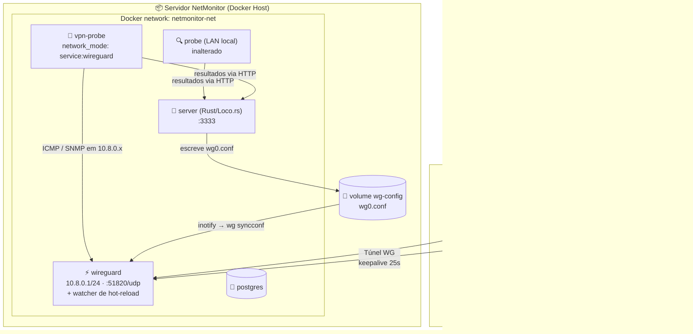
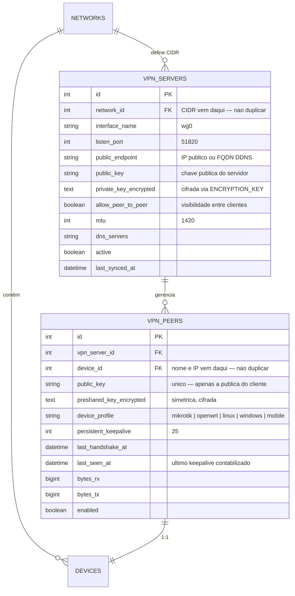
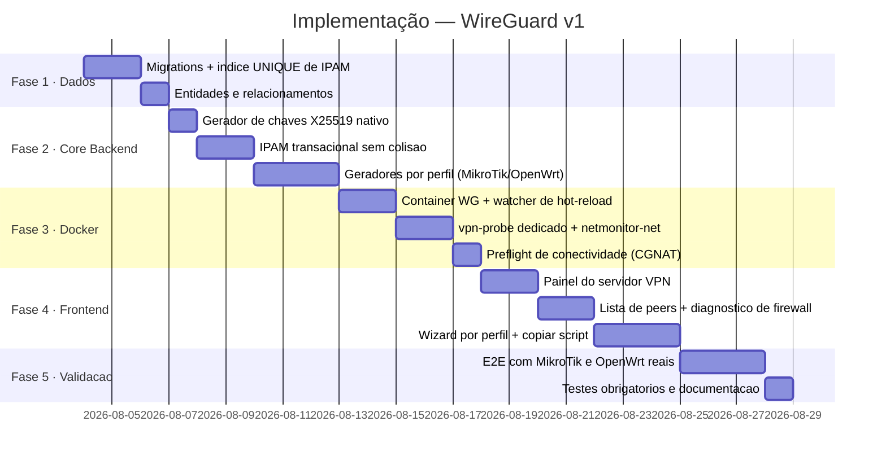

# Roadmap: Módulo WireGuard para Monitoramento de Roteadores Remotos

> **Status:** 🟢 Fases 1 a 4 Concluídas — pendente apenas a Fase 5 (validação E2E com hardware real)
> **Data:** Agosto de 2026
> **Protocolo definido:** WireGuard (exclusivo na v1)
> **Caso de uso primário:** Monitoramento de roteadores **MikroTik (RouterOS v7+)** e **OpenWrt** remotos

---

## 1. Escopo e Posicionamento

### 1.1. Por que VPN, se o NetMonitor já tem Probes?

O NetMonitor **já resolve** o monitoramento de redes remotas através do módulo de Probes (Fase 4 do roadmap principal): um agente leve roda na rede remota, faz conexão *outbound* HTTP para o servidor central, com token SHA-256, heartbeat e buffer offline ([`ProbeAgent`](../backend/src/services/probes/agent.rs)). Não exige abertura de porta nem VPN.

A VPN **não substitui** o probe. Ela cobre o caso que o probe não alcança:

| Cenário | Solução correta |
| :--- | :--- |
| Filial com servidor/PC disponível | 🔵 **Probe** (outbound HTTP, zero firewall) |
| Servidor em nuvem, VPS | 🔵 **Probe** |
| Notebook de campo com SO completo | 🔵 **Probe** |
| **Roteador MikroTik RouterOS** | 🟢 **WireGuard** — não roda container/agente |
| **Roteador OpenWrt** | 🟢 **WireGuard** — WG nativo, agente é inviável em flash limitada |
| Switch/AP/IoT gerenciável só por SNMP | 🟢 **WireGuard** |
| Necessidade de acesso administrativo direto (Winbox, SSH, LuCI) | 🟢 **WireGuard** |

**Regra de decisão:** *se o equipamento pode hospedar um probe, use probe. Se é um roteador ou appliance fechado, use WireGuard.*

### 1.2. Por que WireGuard e não Headscale/Tailscale

A análise anterior levantou Headscale como alternativa por causa do NAT traversal. **O caso de uso resolve a questão:** RouterOS **não possui cliente Tailscale**, enquanto tem WireGuard nativo desde a v7. OpenWrt tem ambos, mas padronizar em dois protocolos por causa de um dos dois alvos não se justifica.

WireGuard é definitivo para a v1. A limitação de NAT que o Headscale resolveria é tratada de frente na seção 2.3.

### 1.3. Por que OpenVPN saiu da v1

OpenVPN exige PKI completa (CA, easy-rsa, emissão, CRL, revogação) — aproximadamente **3x o esforço do WireGuard** — e nenhum dos alvos primários precisa dele: MikroTik v7 e OpenWrt têm WireGuard nativo.

Além disso, a premissa de segurança "o servidor não guarda chave privada" **não vale para OpenVPN**, onde o servidor *é* a Autoridade Certificadora e necessariamente custodia material sensível.

➡️ OpenVPN fica na **Fase 5 (opcional, sob demanda)**, apenas se surgir cliente com firewall que bloqueie UDP.
➡️ L2TP/IPsec: **descartado permanentemente** (múltiplos daemons, dependência de módulos de kernel, instável em Docker).

---

## 2. Arquitetura

### 2.1. Topologia dos Containers



### 2.2. Decisão: `vpn-probe` dedicado (não mover o probe existente)

A proposta original usava `network_mode: "service:wireguard"` no container `probe` atual. Isso foi **rejeitado** por dois motivos concretos:

1. **Acoplamento de ciclo de vida:** se o container WireGuard reinicia, o *network namespace* morre e o `probe` fica permanentemente sem rede — o Docker não o recria sozinho.
2. **Sacrifica o monitoramento da LAN:** mudaria o caminho de rede de *todo* o monitoramento local por causa de um subconjunto de dispositivos.

**Solução adotada:** um **segundo probe dedicado** (`vpn-probe`) compartilhando o namespace do WireGuard, com o `probe` original intacto. O sistema já suporta isso nativamente — existe tabela `probes`, registro por token e despacho por `probe_id` ([`ProbeTaskDispatcher`](../backend/src/services/probes/dispatcher.rs)). **Zero arquitetura nova.**

Ganho adicional: `restart: unless-stopped` no `vpn-probe` faz ele se recuperar sozinho após restart do WireGuard.

### 2.3. Requisito de Endpoint Público (tratamento honesto de NAT/CGNAT)

WireGuard exige que **o servidor NetMonitor** seja alcançável de fora em UDP. Os roteadores monitorados podem estar atrás de qualquer NAT (eles iniciam a conexão), mas o servidor não.

| Situação do servidor | Viabilidade |
| :--- | :--- |
| IP público dedicado / VPS | 🟢 Funciona direto |
| IP público dinâmico + DDNS | 🟢 Funciona (campo de hostname) |
| Atrás de NAT com port-forward UDP 51820 | 🟢 Funciona |
| **Atrás de CGNAT** (IP começando em `100.64.x` – `100.127.x`) | 🔴 **Não funciona** — exige VPS relay |

Isto **não é resolvido** por auto-detecção de IP público. Por isso o painel terá um **teste de pré-voo obrigatório** (seção 4.1) que detecta CGNAT antes de o usuário perder tempo configurando roteadores, e orienta a alternativa (relay em VPS de baixo custo).

### 2.4. Hot-reload de peers sem expor o Docker socket

Para adicionar/remover peers sem derrubar túneis ativos, a opção óbvia seria o container `server` executar `docker exec wireguard wg syncconf`. **Isso foi rejeitado:** montar `/var/run/docker.sock` no container da API equivale a dar root no host a quem comprometer a API.

**Solução adotada — arquivo compartilhado + watcher:**

1. O `server` escreve `/config/wg0.conf` no volume compartilhado `wg-config`.
2. Um watcher dentro do container WireGuard detecta a mudança e executa:
   ```sh
   wg syncconf wg0 <(wg-quick strip wg0)
   ```
3. `syncconf` aplica o delta **sem derrubar os túneis existentes**.

O `server` nunca recebe privilégio de Docker. Apenas o container WireGuard tem `NET_ADMIN`.

### 2.5. Alterações necessárias no `docker-compose.yml`

> ✅ **Aplicado** em [`docker-compose.yml`](../docker-compose.yml): `netmonitor-net` declarada e atribuída a todos os serviços, volume `wg-config` montado no `server` e no `wireguard`, serviços `wireguard` e `vpn-probe` criados.

O compose original **não declarava nenhuma rede nomeada** — usava a default. Foi preciso:

```yaml
services:
  wireguard:
    image: linuxserver/wireguard:latest
    cap_add: [NET_ADMIN, SYS_MODULE]
    sysctls:
      net.ipv4.ip_forward: 1
      net.ipv4.conf.all.src_valid_mark: 1
    ports:
      - "${WG_EXTERNAL_PORT:-51820}:${WG_EXTERNAL_PORT:-51820}/udp"
    volumes:
      - wg-config:/config
    networks: [netmonitor-net]
    restart: unless-stopped

  vpn-probe:
    build: .
    command: ["backend-cli", "task", "probe_run"]
    network_mode: "service:wireguard"   # herda a interface wg0
    environment:
      <<: *app-env
      PROBE_SERVER_URL: http://server:3333
      PROBE_TOKEN: ${VPN_PROBE_TOKEN}
    depends_on: [wireguard, server]
    restart: unless-stopped

  server:
    volumes:
      - wg-config:/config              # escreve wg0.conf
    networks: [netmonitor-net]

volumes:
  wg-config:

networks:
  netmonitor-net:
    driver: bridge
```

> ⚠️ Todos os serviços existentes precisam ganhar `networks: [netmonitor-net]` para que `vpn-probe` resolva `server` por DNS.

---

## 3. Modelo de Dados

### 3.1. Correções sobre o schema real

> ✅ **Tratado.** Os quatro pontos abaixo foram resolvidos nas migrations `1768620800018` a `1768620800020` e nos models novos.

Auditoria contra as migrations existentes revelou quatro pontos a tratar:

| Achado | Correção |
| :--- | :--- |
| `networks.site_id` é **NOT NULL** | O wizard exige/oferece criação de Site para a rede VPN (reusar [`SiteDialog.vue`](../frontend/src/components/SiteDialog.vue)) |
| `devices.ip_address` **sem índice UNIQUE** | Adicionar índice composto — sem ele o IPAM tem condição de corrida |
| Tabela `device_addresses` existia e nunca foi usada | Removida: `devices.ip_address` é o IP primário da VPN e endereços secundários, quando necessários, vêm de `device_interfaces` |
| Projeto usa prefixo `/api` (sem `/v1`) | Endpoints padronizados como `/api/vpn/...` |

**Migration de integridade do IPAM:**

```ts
// devices — impede dois dispositivos com o mesmo IP na mesma rede.
// NULLs são distintos em PG e SQLite, então dispositivos sem IP não colidem.
this.schema.alterTable('devices', (table) => {
  table.unique(['network_id', 'ip_address'])
})
```

### 3.2. Novas Tabelas

> ✅ **Criadas** exatamente com este desenho — ver [`vpn_server.ts`](../backend/src/models/vpn_servers.rs) e [`vpn_peer.ts`](../backend/src/models/vpn_peers.rs).



**Fontes da verdade (sem duplicação):** `networks` = CIDR · `devices` = nome e IP · `vpn_peers` = apenas material criptográfico e telemetria.

### 3.3. Geração de Chaves — Nativa, sem binário `wg`

✅ **Implementado e coberto por teste:** [`key_generator.rs`](../backend/src/services/vpn/key_generator.rs). O teste `derivePublicKey deve reproduzir a pública do par` prova a equivalência com `wg pubkey`. O trecho abaixo mostra a implementação de referência em Node/`node:crypto`, usada na versão anterior do sistema; o resultado é idêntico.

```ts
// modules/vpn/key_generator.ts
import { generateKeyPairSync, createPublicKey, randomBytes } from 'node:crypto'

const PKCS8_X25519_PREFIX = Buffer.from('302e020100300506032b656e04220420', 'hex')

export function generateKeyPair() {
  const { publicKey, privateKey } = generateKeyPairSync('x25519')
  return {
    privateKey: privateKey.export({ type: 'pkcs8', format: 'der' }).subarray(-32).toString('base64'),
    publicKey: publicKey.export({ type: 'spki', format: 'der' }).subarray(-32).toString('base64'),
  }
}

/** Equivalente a `wg pubkey` — deriva a pública a partir da privada. */
export function derivePublicKey(privateKeyB64: string): string {
  const der = Buffer.concat([PKCS8_X25519_PREFIX, Buffer.from(privateKeyB64, 'base64')])
  return createPublicKey({ key: der, format: 'der', type: 'pkcs8' })
    .export({ type: 'spki', format: 'der' })
    .subarray(-32)
    .toString('base64')
}

/** Equivalente a `wg genpsk`. */
export const generatePresharedKey = () => randomBytes(32).toString('base64')
```

**Por que isso importa:** sem dependência do binário `wg` no container da API, e o desenvolvimento roda 100% em Windows sem Docker — alinhado com a diretriz de independência de ambiente do [AGENTS.md](../AGENTS.md).

### 3.4. Segurança das Chaves

| Chave | Onde vive | Justificativa |
| :--- | :--- | :--- |
| Privada do **servidor** | Banco, **cifrada** com XChaCha20-Poly1305, chave derivada do `ENCRYPTION_KEY` (`services/shared/crypto.rs`) | Necessária para reconstruir `wg0.conf` |
| Privada do **cliente** | **Nunca persistida.** Gerada em memória, entregue uma vez, descartada | Vazamento do banco não compromete clientes |
| Pública do cliente | Banco, texto puro | É pública por definição |
| Preshared key | Banco, **cifrada** | Simétrica — o servidor precisa dela no `wg0.conf` |

Perdeu o script? Botão **"Rotacionar chaves"** gera novo par e atualiza o peer. A chave antiga é invalidada imediatamente.

---

## 4. Experiência do Usuário (o núcleo desta entrega)

### 4.0. A decisão de UX mais importante: QR Code não serve para roteadores

**MikroTik e OpenWrt não leem QR Code.** Um wizard centrado em QR Code — como o desenho original — falha justamente no caso de uso primário.

O que esses equipamentos precisam é **script pronto para colar no terminal**. O sistema gera o artefato certo por perfil:

| Perfil | Artefato gerado | Ação principal |
| :--- | :--- | :--- |
| 📟 **MikroTik RouterOS v7+** | Script `/interface/wireguard/...` | **Copiar script** |
| 📟 **OpenWrt** | Bloco de comandos `uci` | **Copiar script** |
| 🐧 Linux | Arquivo `wg0.conf` | Download |
| 🪟 Windows | Arquivo `.conf` para o app oficial | Download |
| 📱 Android / iOS | QR Code | Escanear |

### 4.1. Tela 1 — Servidor VPN (`/vpn`)

> ✅ **Entregue** em [`VpnServerPage.vue`](../frontend/src/pages/vpn/VpnServerPage.vue).

Painel único de configuração, sem abas por protocolo (só existe WireGuard na v1):

- **Estado do serviço:** 🟢 Ativo · peers conectados · tráfego agregado
- **Endereço público:** campo com botão **"Detectar automaticamente"**
- **🔍 Teste de Pré-voo (destaque da tela):** botão **"Testar acessibilidade externa"** que verifica se UDP 51820 está alcançável de fora e retorna um diagnóstico direto:
  - 🟢 `Porta alcançável. Roteadores podem conectar.`
  - 🟡 `Porta fechada. Configure port-forward UDP 51820 no seu roteador.`
  - 🔴 `CGNAT detectado (IP 100.x). Seu provedor não permite conexões de entrada — será necessário um relay em VPS.`
- Sub-rede CIDR, porta, MTU (1420), DNS
- **Toggle "Permitir que os dispositivos VPN se enxerguem entre si"** com explicação em linguagem simples
- Botão **"Salvar e aplicar"** — aplica via `syncconf`, **sem derrubar túneis ativos**

### 4.2. Tela 2 — Dispositivos VPN (`/vpn/devices`)

> ✅ **Entregue** em [`VpnDevicesPage.vue`](../frontend/src/pages/vpn/VpnDevicesPage.vue). Os limiares vivem em [`vpn_peer.ts`](../backend/src/models/vpn_peers.rs).

Tabela com status derivado do **último sinal de vida** (`last_seen_at`), não do handshake.

> ⚠️ O handshake **não** serve como sinal de vida. O WireGuard só renegocia
> chaves quando tem dados para enviar, então um túnel ocioso e perfeitamente
> saudável passa vários minutos sem handshake novo — com o critério antigo
> (3 min) ele piscava "Instável" e voltava sozinho. Quem prova que o túnel está
> de pé é o `PersistentKeepalive`: a cada 25s o servidor contabiliza bytes
> novos, e é esse incremento que `peer_status.ts` carimba em `last_seen_at`.

A cadência do sinal não é o `PersistentKeepalive` puro. O valor que aparece no
dump é o intervalo do *servidor*, e quem faz o RX subir é a resposta do peer —
um keepalive passivo emitido `KEEPALIVE_TIMEOUT` (10s) depois. A régua real é
`keepalive + 10s`, ou seja ≈ 35s no padrão de 25s.

| Status | Regra (com keepalive) | Regra (só handshake) | Significado |
| :--- | :--- | :--- | :--- |
| 🟢 Conectado | sinal < 3 × 35s + folga (150s) | sinal < `REJECT_AFTER_TIME` + folga (225s) | Túnel ativo |
| 🟡 Instável | entre a janela de conectado e o dobro dela (300s) | entre a janela de conectado e 600s | Keepalive falhando |
| 🔴 Desconectado | sinal > 300s | sinal > 600s | Fora do ar |
| ⚪ Aguardando | nunca houve sinal | nunca houve sinal | Script ainda não aplicado no roteador |

As duas colunas existem porque o silêncio significa coisas diferentes em cada
caso. Com keepalive há batimento previsível, então o dobro da janela de
conectado já é diagnóstico. Sem keepalive um túnel ocioso é indistinguível de um
túnel morto — o WireGuard não renegocia sem ter o que enviar — e declarar queda
cedo seria chute; daí os 600s, o mesmo valor adotado pelo wg-easy.

Colunas: Nome · Perfil (ícone) · IP fixo · Última atividade ("há 20 segundos", com o handshake no tooltip) · Tráfego RX/TX · Ações.

**Frescor dos dados:** o watcher republica `wg show dump` a cada 5s, o scheduler
sincroniza o status a cada 10s (o histórico de tráfego segue em 30s) e
`GET /api/vpn/peers` sincroniza antes de responder — a lista nunca depende do
próximo ciclo do background para mostrar um túnel que acabou de subir.

**Ações por linha:** 📋 Copiar script · ⬇️ Baixar config · 📲 QR Code (só perfis móveis) · 🔄 Rotacionar chaves · 🚫 Revogar.

#### 🎯 Diagnóstico do erro nº 1

O erro mais comum ao conectar um roteador é: **túnel sobe, mas o monitoramento não responde** — porque falta liberar ICMP/SNMP na chain `input` da interface WireGuard.

> ✅ **Entregue.** O flag `needsFirewallHint` (prova fresca de vida do túnel **e** monitor de ping `down`) é calculado em [`peer_hints.ts`](../backend/src/services/vpn/peer_hints.rs), compartilhado entre `GET /vpn/peers` e o snapshot publicado em `vpn:peers_updated`. O botão chama `POST /api/vpn/peers/:id/firewall-hints`, que devolve as regras do perfil do equipamento.

> ⚠️ A régua aqui é `hasFreshProofOfLife`, **não** `connectionStatus === 'connected'`.
> O ping vira `down` no primeiro erro, enquanto a janela de conectado tolera
> minutos de propósito para o status não piscar. Quem desconectasse o
> equipamento caía na brecha entre as duas e via "túnel conectado, mas não
> responde a ping" — afirmando o oposto do que havia acontecido. O aviso exige
> um batimento dentro de uma única cadência de keepalive mais a folga da coleta.

O sistema detecta isso automaticamente (túnel comprovadamente vivo + ping falhando) e exibe um alerta acionável na linha:

> ⚠️ **Túnel conectado, mas o dispositivo não responde a ping.**
> Provavelmente falta liberar o tráfego na interface WireGuard.
> **[ Copiar regras de firewall ]**

Isso transforma o suporte mais frequente em um clique.

### 4.3. Tela 3 — Wizard "Adicionar Dispositivo VPN"

> ✅ **Entregue** em [`VpnPeerWizard.vue`](../frontend/src/components/VpnPeerWizard.vue) (passos 1 e 2) + [`VpnScriptViewer.vue`](../frontend/src/components/VpnScriptViewer.vue) (passo 3, com "Copiar tudo", download e QR Code).

**Passo 1 — Qual equipamento?**
Cards visuais grandes: `MikroTik` · `OpenWrt` · `Linux` · `Windows` · `Celular`.
Essa escolha define todo o resto do fluxo.

**Passo 2 — Identificação**
Nome · Site · IP fixo (**sugerido automaticamente**, o próximo livre do CIDR) · toggle **"Monitorar via SNMP"** com campo de community.

**Passo 3 — Pronto para conectar**
Tela de resultado com o script já gerado, chaves preenchidas e botão **"Copiar tudo"** em destaque, mais instruções de 1 linha ("Cole no terminal do Winbox → New Terminal").

**O usuário nunca digita nem cola uma chave manualmente.**

### 4.4. Script gerado — MikroTik RouterOS v7+

```rsc
# === NetMonitor · WireGuard ===
/interface/wireguard/add name=wg-netmonitor listen-port=13231 private-key="<PRIV_CLIENTE>"
/ip/address/add address=10.8.0.11/24 interface=wg-netmonitor

/interface/wireguard/peers/add interface=wg-netmonitor \
    public-key="<PUB_SERVIDOR>" \
    preshared-key="<PSK>" \
    endpoint-address=vpn.exemplo.com.br endpoint-port=51820 \
    allowed-address=10.8.0.0/24 \
    persistent-keepalive=25s

# Libera monitoramento vindo do NetMonitor
/ip/firewall/filter/add chain=input in-interface=wg-netmonitor protocol=icmp \
    action=accept comment="NetMonitor ICMP" place-before=0
/ip/firewall/filter/add chain=input in-interface=wg-netmonitor protocol=udp \
    dst-port=161 action=accept comment="NetMonitor SNMP" place-before=0

# SNMP (preenchido com a community cadastrada no NetMonitor)
/snmp/community/set [find default=yes] addresses=10.8.0.0/24 name="<COMMUNITY>"
/snmp/set enabled=yes contact="NetMonitor"
```

### 4.5. Script gerado — OpenWrt

```sh
# === NetMonitor · WireGuard ===
opkg update && opkg install wireguard-tools luci-proto-wireguard

uci set network.wg_nm=interface
uci set network.wg_nm.proto='wireguard'
uci set network.wg_nm.private_key='<PRIV_CLIENTE>'
uci set network.wg_nm.mtu='1420'
uci add_list network.wg_nm.addresses='10.8.0.12/24'

uci add network wireguard_wg_nm
uci set network.@wireguard_wg_nm[-1].public_key='<PUB_SERVIDOR>'
uci set network.@wireguard_wg_nm[-1].preshared_key='<PSK>'
uci set network.@wireguard_wg_nm[-1].endpoint_host='vpn.exemplo.com.br'
uci set network.@wireguard_wg_nm[-1].endpoint_port='51820'
uci set network.@wireguard_wg_nm[-1].persistent_keepalive='25'
uci set network.@wireguard_wg_nm[-1].route_allowed_ips='1'
uci add_list network.@wireguard_wg_nm[-1].allowed_ips='10.8.0.0/24'

# Zona de firewall permitindo monitoramento
uci add firewall zone
uci set firewall.@zone[-1].name='vpn_netmonitor'
uci set firewall.@zone[-1].input='ACCEPT'
uci set firewall.@zone[-1].output='ACCEPT'
uci set firewall.@zone[-1].forward='REJECT'
uci add_list firewall.@zone[-1].network='wg_nm'

uci commit network && uci commit firewall
/etc/init.d/network restart && /etc/init.d/firewall restart
```

### 4.6. ⚠️ Duas regras inegociáveis do gerador

> ✅ **Garantidas por constante e por teste.** `PERSISTENT_KEEPALIVE_SECONDS = 25` vive em [`profile_contract.ts`](../backend/src/services/vpn/config_builder.rs) e nenhum gerador aceita `AllowedIPs` diferente do CIDR da VPN. Os testes de `tests/unit/vpn.spec.ts` afirmam o keepalive e usam `notInclude('0.0.0.0/0')` nos três geradores.

Estas duas decisões determinam se o módulo funciona na prática:

**1. `PersistentKeepalive = 25` é obrigatório**
Os roteadores estão atrás de NAT. Sem keepalive, a tradução NAT expira e **o servidor não consegue iniciar ICMP/SNMP em direção ao roteador** — o monitoramento simplesmente para de funcionar após alguns minutos de ociosidade. Não é campo opcional; é fixo no gerador.

**2. `AllowedIPs` = apenas o CIDR da VPN — nunca `0.0.0.0/0`**
Se o script gerasse `0.0.0.0/0`, **todo o tráfego de internet do cliente** passaria pelo túnel, derrubando a navegação da rede inteira. O gerador emite exclusivamente `10.8.0.0/24`. Não é campo editável na UI.

### 4.7. Provisionamento automático do monitoramento

> ✅ **Entregue** em [`vpn_peer_service.ts`](../backend/src/services/vpn/peer_service.rs) + [`monitor_provisioner.ts`](../backend/src/services/vpn/monitor_provisioner.rs), com teste funcional cobrindo device, peer e os dois monitores.

Ao concluir o wizard, o sistema executa em uma transação:

1. Cria o `Device` (`type = 'router'`, `ip_address` da VPN, `network_id` da rede VPN)
2. Cria o `VpnPeer` vinculado
3. Cria **monitor de Ping** apontando para o IP da VPN, atribuído ao `vpn-probe`
4. Se SNMP marcado, cria **monitor SNMP** (o *scan* de interfaces continua disparável pela tela do dispositivo)
5. Reescreve `wg0.conf` → watcher aplica via `syncconf`

O roteador aparece no Dashboard, na Topologia e nos Alertas **sem nenhum cadastro adicional**.

---

## 5. API Backend

Prefixo `/api` (consistente com [`start/routes.ts`](../backend/src/app.rs)):

| Método | Endpoint | Descrição | Status |
| :--- | :--- | :--- | :---: |
| `GET` | `/api/vpn/server` | Configuração e estado do servidor WireGuard | ✅ |
| `PUT` | `/api/vpn/server` | Atualiza configuração e aplica via `syncconf` | ✅ |
| `POST` | `/api/vpn/server/preflight` | Testa acessibilidade externa e detecta CGNAT | ✅ |
| `POST` | `/api/vpn/server/detect-endpoint` | Auto-detecta IP público | ✅ |
| `GET` | `/api/vpn/peers` | Lista peers com status de handshake e tráfego | ✅ |
| `GET` | `/api/vpn/peers/next-ip` | Próximo IP livre do CIDR (sugestão do wizard) | ✅ *extra* |
| `POST` | `/api/vpn/peers` | Cria peer, aloca IP, provisiona device + monitores | ✅ |
| `GET` | `/api/vpn/peers/:id/config` | 🔒 Artefato de configuração conforme o perfil | ✅ |
| `GET` | `/api/vpn/peers/:id/qrcode` | 🔒 QR Code (perfis móveis) | ✅ |
| `POST` | `/api/vpn/peers/:id/rotate` | Rotaciona chaves | ✅ |
| `POST` | `/api/vpn/peers/:id/firewall-hints` | Regras de firewall do perfil (diagnóstico) | ✅ |
| `DELETE` | `/api/vpn/peers/:id` | Revoga peer e libera o IP | ✅ |

🔒 **Endpoints sensíveis** (`/config`, `/qrcode`) devolvem credencial de acesso à rede. Exigem:
- ⏳ Autenticação obrigatória — **pendente**: o grupo `/api` inteiro ainda não usa `middleware.auth()` porque o [`AuthController`](../backend/src/controllers/auth.rs) é stub. Aplicar ao grupo quando a autenticação real entrar.
- [x] Rate limit por usuário (janela deslizante em [`access_control.ts`](../backend/src/services/vpn/access_control.rs))
- [x] **Registro em log de auditoria** (quem baixou, quando, qual peer)
- [x] Chave privada disponível **apenas na primeira chamada** após criação/rotação

---

## 6. Roadmap de Implementação



### Fase 1 · Modelo de Dados (Concluído 🟢)
- [x] Migration `vpn_servers` e `vpn_peers`
- [x] Migration de índice `unique(['network_id', 'ip_address'])` em `devices`
- [x] Models `VpnServer` e `VpnPeer` com cifragem de chaves via `encryption`
- [x] Relacionamento `Device` ↔ `VpnPeer`

### Fase 2 · Core Backend (Concluído 🟢)
- [x] `modules/vpn/key_generator.ts` — X25519 nativo (código validado na seção 3.3)
- [x] `modules/vpn/cidr.ts` — cálculo de faixas IPv4 (base do IPAM)
- [x] `modules/vpn/ip_allocator.ts` — alocação transacional com retry em violação de unicidade
- [x] `modules/vpn/config_builder.ts` + `config_writer.ts` — geração e escrita atômica do `wg0.conf`
- [x] `modules/vpn/profiles/profile_contract.ts` + `profile_registry.ts` — contrato e resolução por perfil
- [x] `modules/vpn/profiles/mikrotik.ts` — script RouterOS
- [x] `modules/vpn/profiles/openwrt.ts` — script UCI
- [x] `modules/vpn/profiles/wg_conf.ts` — `.conf` padrão (Linux/Windows/mobile)
- [x] `modules/vpn/peer_status.ts` — parser de `wg show dump` (handshake e tráfego)
- [x] `modules/vpn/vpn_server_service.ts` · `vpn_peer_service.ts` · `monitor_provisioner.ts` — provisionamento transacional (§4.7)
- [x] `modules/vpn/secret_store.ts` + `access_control.ts` — chave privada de uso único, rate limit e auditoria
- [x] Controllers `VpnServersController` / `VpnPeersController` e rotas `/api/vpn/...`
- [x] Testes unitários dos geradores validando keepalive e `AllowedIPs` restrito
- [x] Testes funcionais da API (`tests/functional/vpn_api.spec.ts`)

### Fase 3 · Docker e Rede (Concluído 🟢)
- [x] Declarar `netmonitor-net` e aplicar a **todos** os serviços existentes
- [x] Serviço `wireguard` com `NET_ADMIN` e volume `wg-config`
- [x] Watcher de hot-reload via `wg syncconf` (sem docker.sock) — `docker/wireguard/scripts/netmonitor-watcher.sh`
- [x] Serviço `vpn-probe` com `network_mode: service:wireguard`
- [x] Registro automático do `vpn-probe` na inicialização (`services/vpn/probe_registrar.rs`, com fallback para `DEFAULT_VPN_PROBE_TOKEN = "default_vpn_probe_token"`) + comando `backend-cli task vpn_probe_register` para geração manual de tokens.
- [x] Endpoint de preflight com detecção de CGNAT
- [x] Corrigido o parsing de latência do `PingChecker` para o formato `round-trip min/avg/max` do BusyBox (Alpine)

### Fase 4 · Frontend (Concluído 🟢)
- [x] `frontend/src/pages/vpn/VpnServerPage.vue` — painel + preflight
- [x] `frontend/src/pages/vpn/VpnDevicesPage.vue` — lista + diagnóstico
- [x] `frontend/src/components/VpnPeerWizard.vue` — wizard por perfil
- [x] `frontend/src/components/VpnScriptViewer.vue` — visualizador com "Copiar tudo"
- [x] `frontend/src/stores/vpn.ts` — store Pinia
- [x] Rotas em [`frontend/src/router/index.ts`](../frontend/src/router/index.ts)
- [x] Item de menu em [`frontend/src/layouts/DefaultLayout.vue`](../frontend/src/layouts/DefaultLayout.vue)

### Fase 5 · Validação (Pendente — exige hardware e IP público)
- [X] Conectar MikroTik RouterOS v7 real e validar ICMP + SNMP pelo túnel
- [ ] Conectar OpenWrt real e validar ICMP + SNMP pelo túnel
- [ ] Validar que o túnel sobrevive a 30+ min de ociosidade (prova do keepalive)
- [ ] Confirmar que a internet do roteador **não** passa pelo túnel (prova do `AllowedIPs`)
- [ ] Validar isolamento peer-to-peer nos dois modos
- [ ] Confirmar que `syncconf` não derruba túneis ao adicionar peer
- [x] Rotina obrigatória executada e **100% verde** na época desta fase. A rotina atual é `cargo fmt --all --check` · `cargo clippy --all-targets -- -D warnings` · `cargo test` · `npm --prefix frontend run typecheck` · `format` · `lint` · `build` · `docker compose config`

> **Nota sobre ambiente de testes:** as Fases 1, 2 e 4 rodam integralmente em Windows local. A Fase 5 exige host Linux com IP público ou port-forward UDP — não é validável em Docker Desktop sem exposição externa.

> **Achado paralelo — resolvido na Fase 3:** o [`PingChecker`](../backend/src/services/monitoring/checkers/ping.rs) precisou aprender a ler ambos os formatos de saída de latência: `rtt min/avg/max/mdev` (iputils) e `round-trip min/avg/max` (BusyBox). No backend Rust o ping é feito por socket ICMP DGRAM (`surge-ping`), sem depender do binário `ping` da imagem; a imagem de runtime é `debian:bookworm-slim`, não a imagem Node Alpine usada pelo frontend.

---

### 6.1. Notas de implementação (decisões tomadas durante a entrega)

| Ponto | Como ficou |
| :--- | :--- |
| **Telemetria dos túneis** | O watcher publica `wg show <iface> dump` em `/config/<iface>.status` no mesmo volume; a API lê e interpreta esse arquivo ([`peer_status.rs`](../backend/src/services/vpn/peer_status.rs)). Mantém a premissa de que o container da API não tem `NET_ADMIN` nem Docker socket. **Todo processo que sincroniza telemetria precisa do volume `wg-config` e de `WG_CONFIG_DIR`** — vale para `server` *e* `scheduler`. Sem isso a leitura devolve vazio e a sincronização vira um no-op: o processo segue publicando `vpn:peers_updated` com dados congelados, e como `connectionStatus` é calculado ao vivo, a tela vê o status decair sozinho até "Desconectado" enquanto o F5 mostra o valor certo. `readStatus` passou a avisar no log quando o dump não pode ser lido. |
| **Preflight** | Detecta CGNAT (faixa 100.64/10) e servidor atrás de NAT comparando o IP público com as interfaces locais. Sem um verificador externo não é possível *provar* que a porta UDP aceita entrada — por isso o resultado traz o campo `verified`, e a UI diz explicitamente que a confirmação final ocorre no primeiro handshake. |
| **QR Code** | Gerado no backend em SVG (dependência `qrcode` adicionada ao `backend/Cargo.toml`) e renderizado pelo `VpnScriptViewer`. |
| **Chave privada do cliente** | Fica em memória em [`secret_store.rs`](../backend/src/services/vpn/secret_store.rs) com TTL de 15 min e é consumida na primeira leitura de `/config`. Depois disso o artefato traz um placeholder e a única saída é **Rotacionar chaves** — exatamente o comportamento descrito no §3.4. |
| **Revogação** | `DELETE /api/vpn/peers/:id` remove o peer **e** o `Device` correspondente (em transação), o que libera o IP para reuso, e em seguida reescreve o `wg0.conf`. |
| **Autenticação** | As rotas `/api/vpn/...` seguem o mesmo padrão das demais rotas do projeto (sem o middleware `auth`, que hoje depende de um `AuthController` ainda stub). Os endpoints sensíveis já têm **rate limit por usuário/IP** e **log de auditoria** (`access_control.rs`); basta aplicar `middleware.auth()` ao grupo `/api` quando a autenticação real entrar. |
| **Isolamento entre peers** | Escrito como `PostUp`/`PostDown` no `wg0.conf`. Como `wg syncconf` aplica somente o delta de peers, a troca do modo de isolamento só vale quando a interface sobe — o watcher faz `wg-quick up` quando ela está fora do ar. |

---

## 7. Segurança

1. **Exposição mínima:** apenas UDP 51820 é publicada. `NET_ADMIN` fica restrito ao container WireGuard.
2. **Sem Docker socket na API:** hot-reload por arquivo compartilhado + watcher (seção 2.4).
3. **Chaves privadas de cliente nunca persistidas;** chaves do servidor e PSKs cifradas via `ENCRYPTION_KEY`.
4. **Revogação imediata:** excluir o peer reescreve `wg0.conf` e o `syncconf` derruba o acesso na hora.
5. **Auditoria** de todo download de configuração.
6. **Isolamento configurável** entre peers:
   ```bash
   # Modo visível
   iptables -A FORWARD -i wg0 -o wg0 -j ACCEPT
   # Modo isolado — só fala com o gateway/probe
   iptables -A FORWARD -i wg0 -d 10.8.0.1 -j ACCEPT
   iptables -A FORWARD -i wg0 -o wg0 -j DROP
   ```
   > Para monitoramento puro, **modo isolado é o padrão recomendado**: cada roteador fala só com o NetMonitor, e um cliente comprometido não alcança os demais.

---

## 8. Registro de Decisões de Arquitetura

| # | Decisão | Motivo |
| :--- | :--- | :--- |
| 1 | VPN complementa o Probe, não o substitui | Probe já resolve filiais/VPS; VPN é para roteadores fechados |
| 2 | WireGuard exclusivo na v1 | RouterOS v7 e OpenWrt têm WG nativo; OpenVPN custa 3x |
| 3 | Headscale descartado | RouterOS não tem cliente Tailscale |
| 4 | `vpn-probe` dedicado | Evita acoplar o probe da LAN ao ciclo de vida do WG |
| 5 | Hot-reload por arquivo + watcher | Evita expor `docker.sock` ao container da API |
| 6 | Geração X25519 nativa no Node | Sem binário `wg`; desenvolvimento roda em Windows |
| 7 | Scripts por perfil no lugar de QR Code | Roteadores não leem QR Code |
| 8 | `PersistentKeepalive` fixo em 25s | Sem ele o servidor não alcança o roteador atrás de NAT |
| 9 | `AllowedIPs` restrito ao CIDR da VPN | `0.0.0.0/0` derrubaria a internet do cliente |
| 10 | Índice UNIQUE `(network_id, ip_address)` | Elimina condição de corrida no IPAM |
| 11 | CGNAT tratado por preflight explícito | Auto-detecção de IP não resolve CGNAT; melhor avisar cedo |
| 12 | Telemetria por arquivo `<iface>.status` | Mesmo canal do hot-reload: a API lê `wg show dump` sem `NET_ADMIN` nem `docker.sock` |
| 13 | Revogação apaga o `Device` junto | É o que efetivamente libera o IP no índice UNIQUE do IPAM |
| 14 | Chave privada do cliente em store de uso único | Cumpre "entregue uma vez e descartada" sem persistir nada |
